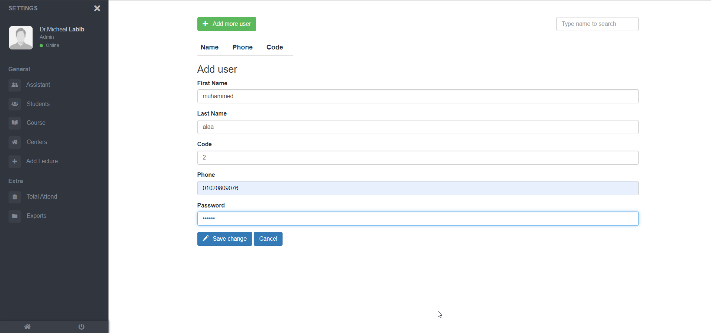
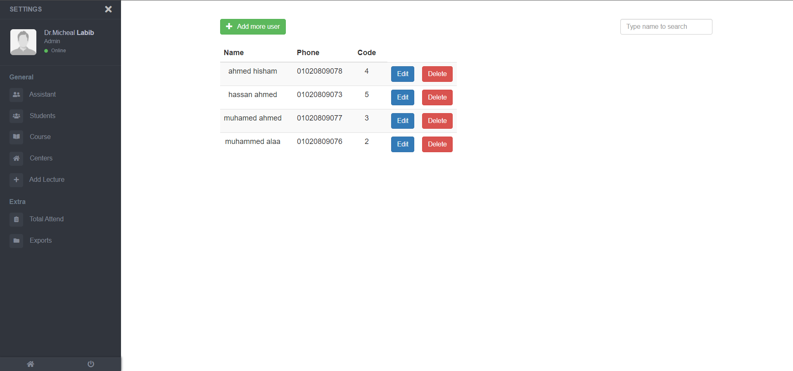
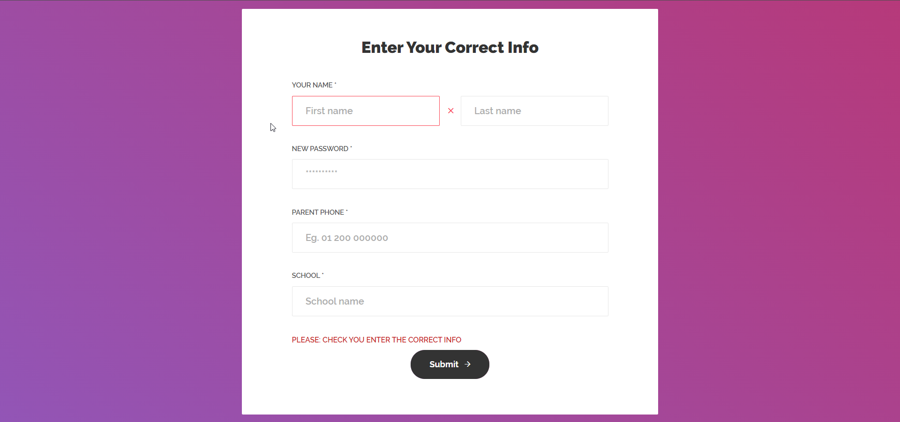
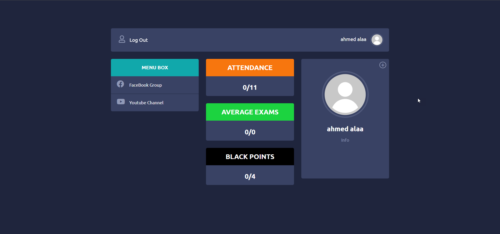

  

 📚 A site for chemistry course management with the teacher as an admin, assistant ,and students to manage lectures timetable, attendance ,and exams grads.
      

---

## 🏁 Install 

1. Install [Visual Studio code](https://code.visualstudio.com/).
2. Install [MySQL](https://www.mysql.com).
3. Execute `chem_course` on the `MySQL`.

**Note:** Do not forget to change the `connection` in `./config/database.js`.

## ⛏️ Built Using 

- Server: [NodeJs](https://nodejs.org/en/download/) with [Express](https://expressjs.com/) as framework.
- database: [MySQL](https://www.mysql.com).
- Code Style: [airbnb](https://github.com/airbnb/javascript)

### 📷 ScreenShots

---

  

### ✨ Contributors

<table>
  <tr>
    <td align="center"><a href="https://github.com/MuhammeedAlaa"> <b>Muhammad Alaa</b></a> </td>
     <td align="center"><a href="https://github.com/Etshawy1"> <b>Muhammad Ahmed</b></a> </td>
  </tr>
 </table>

### ⚖ Licence&nbsp; &nbsp; &nbsp;

[MIT Licence](./License)
